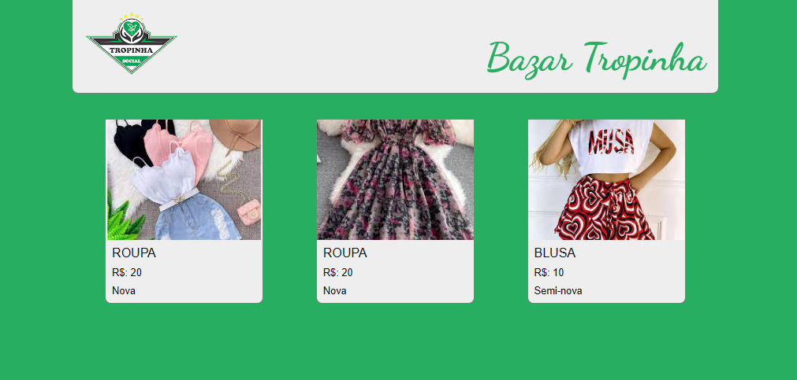
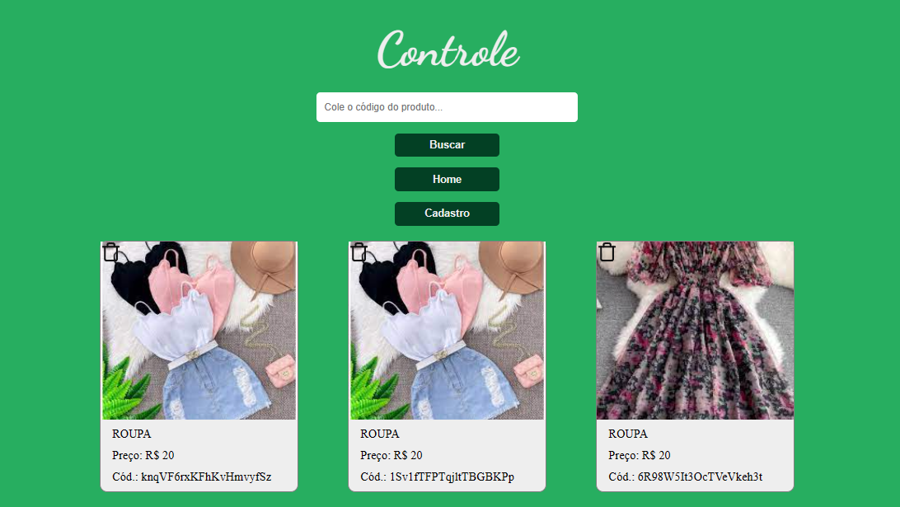
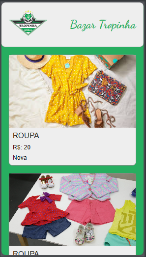
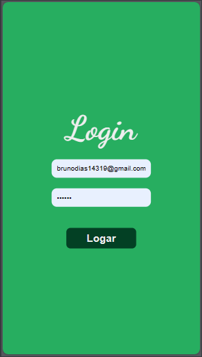
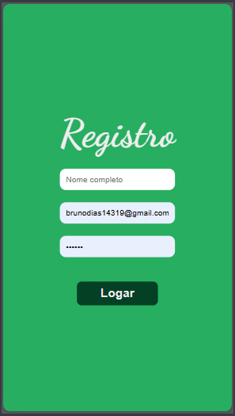
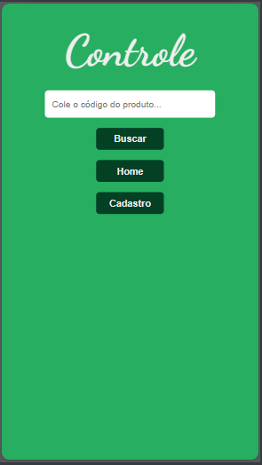

<hr>

### Tópicos

- [Descrição do projeto](#descrição-do-projeto)

- [Funcionalidades](#funcionalidades)

- [Layout](#layout)

- [Ferramentas utilizadas](#ferramentas-utilizadas)

- [Acesso ao projeto](#acesso-ao-projeto)

- [Abrir e rodar o projeto](#abrir-e-rodar-o-projeto)

- [Desenvolvedor](#desenvolvedor)

## Descrição do projeto
Projeto autoral com a finalidade de atender a uma demanda do Projeto Social [Projeto Tropinha](https://projetotropinha.org/). Instituição da qual eu sou voluntário, e que está sempre fazendo Bazar beneficente, seja presencial ou online, para arrecadar fundos para a manutenção e a ampliação desta organização sem fins lucrativos.

A aplicação conta com página de login, para que somente usuários cadastrados possam inserir e deletar itens. A página home pode ser acessada por todos, contando também com a página de detalhes do produto, com link direto para o WhatsApp do administrador do projeto.

🎈 <i><b>OBS:</b></i> Projeto ainda em desenvolvimento, sendo feito alguns ajustes.

<p align="justify">

  


</p>

## Funcionalidades

:heavy_check_mark: `Funcionalidade 1:` Site para venda de roupas.

:heavy_check_mark: `Funcionalidade 2:` Login do usuário e proteção de rota.

:heavy_check_mark: `Funcionalidade 3:` Formulário para inserir dados e imagens dos produtos.

:heavy_check_mark: `Funcionalidade 4:` Página de detalhes dos produtos com as imagens expostas em slide, e um botão para fazer o pedido. Ao clicar no botão, o usuário é direcionado diretamente ao WhatsApp do administrador com um texto de pedido, indicando o código do produto que é gerado dinamicamente, para que ao ser confirmada a compra, o administrador copie este código, e busque por este item na página de controle, onde somente ele tem acesso, para deletá-lo do catálogo.

## Layout

<div align="center">




### Layout Responsivo

      

  </div>

###

## Ferramentas utilizadas

       

- React
- TypeScript
- JavaScript
- Firebase
- HTML
- Git
- Styled-Components

🎈 <i><b>OBS:</b></i> 

Foi utilizado o Firebase porque traz a estrutura de login e armazenamento de dados no banco sem a necessidade de implementar algo mais complexo.

O uso do Styled-Components resolve alguns problemas, como a repetição de códigos, visto que nos permite criar componentes reutilizáveis e compartilháveis, tornando manutenções e futuras mudanças mais simples.     

###

## Acesso ao projeto

Você pode [acessar o site do projeto](https://bazar-online-tropinha.vercel.app/).

## Abrir e rodar o projeto

```cmd
# Clone este repositório
git clone <link do repositório>

# Acesse a pasta do projeto no seu terminal
cd <nome do projeto>

# Instalar dependências
npm install

# Execute a aplicação
npm run dev
```

## Desenvolvedor

[<br><sub>Bruno Dias de Freitas</sub>](https://www.linkedin.com/in/brunodias-dev)
